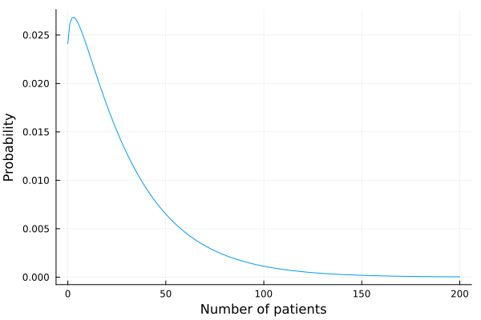
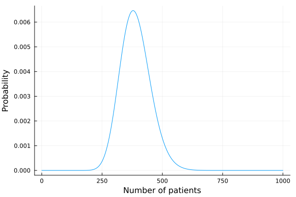
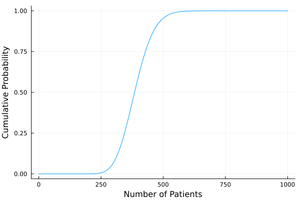
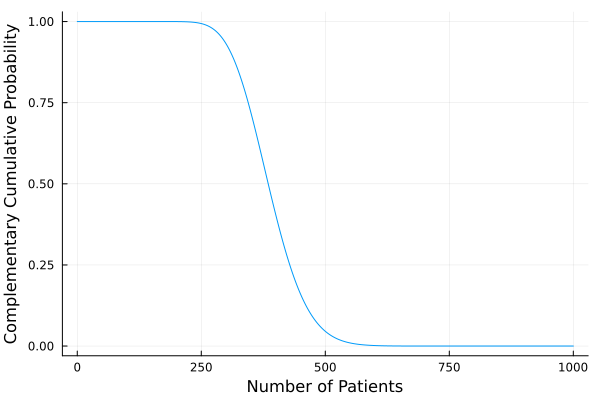
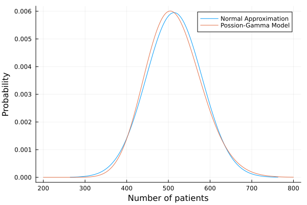

# ClinicalTrialOptm.jl

ClinicalTrialOptm.jl implements algorithms to solve multi-center, multi-state clinical trial recruitment problems. It considers the following parameters:
* Number of countries patients are recruited from, $J$
* Expected mean enrollment rates per center in each country, $m_j, j = 1,...,J$
* Variances of enrollment rates per center in each country, $s^2_j, j = 1,...,J$
* Lower bounds and upper bounds for the number of centers in each country, $l_j \le x_j \le u_j, j = 1,...,J$
* Cost of initializing one center in each country, $c_0j, j = 1,...,J$
* Cost of running one center in each country per unit of time, $c_j, j = 1,...,J$
* Cost per one enrolled patient in different countries $q_j, j = 1,...,J$
* Time a center is initialized in country $j, T_0j, j = 1,...,J$
* Duration of enrollment period, $T$
* Probability of a patient dropout in each country, $d_j, j = 1,...,J$
* The target patient enrollment, $n$
* The estimated probability of success

to find the optimal number of clinics for each country, minimizing cost.

Details on the calculations are described in the paper:
(Insert paper here)


## Installation

ClinicalTrialOptm.jl requires Julia v1.7 or later. The package has not been registered yet and must be isntalled using the repository location. To do so, start Julia and use the `]` key to switch to the package manager REPL:

```{julia}
(@v1.8) Pkg> add https://github.com/Hua-Zhou/ClinicalTrialOptm.jl.git
```

Use the backspace key to return to the Julia REPL.


```julia
versioninfo()
```

    Julia Version 1.8.1
    Commit afb6c60d69a (2022-09-06 15:09 UTC)
    Platform Info:
      OS: macOS (arm64-apple-darwin21.5.0)
      CPU: 8 × Apple M1
      WORD_SIZE: 64
      LIBM: libopenlibm
      LLVM: libLLVM-13.0.1 (ORCJIT, apple-m1)
      Threads: 4 on 4 virtual cores
    Environment:
      JULIA_NUM_THREADS = 4


```julia
# for use in this tutorial
using ClinicalTrialOptm
using Distributions, HiGHS, SCS, Pajarito, SCIP, MathOptInterface, JuMP, Plots, StatsPlots
const MOI = MathOptInterface;
```

## Inputting Parameters

There are two types of data structs within this package: `Country` and `ClinicalTrial`:

### `Country`

```@docs
Country
```

Example use:


```julia
m = 1.5
s² = 2.0
l, u = 0, 10
c₀ = 20_000.0
c = 5_000.0
q = 1_500.0
d = 0.05
T₀ = Uniform(0.0, 6.0)
Td = 24.0
ctry = Country(m, s², l, u, c₀, c, q, d, T₀, Td)
```


    Country{Float64}(1.5, 2.0, 0, 10, 20000.0, 5000.0, 1500.0, 0.05, Uniform{Float64}(a=0.0, b=6.0), 24.0)


### `ClinicalTrial`

```@doc 
ClinicalTrial
```

Example use:


```julia
m = [1, 1.2, 1.4, 1.2]
s² = [0.2, 0.4, 0.8, 0.6]
l = [0, 3, 2, 1]
u = [8, 5, 7, 4]
c₀ = [15000.0, 13000.0, 16000.0, 17000.0]
c = [3000.0, 2000.0, 5000.0, 8000.0]
q = [1000.0, 1300.0, 900.0, 800.0]
d = [0.01, 0.05, 0.09, 0.15]
T₀ = fill(Uniform(0.0, 6.0), 4)
Td = 24.0
ct = ClinicalTrial(m, s², l, u, c₀, c, q, d, T₀, Td)
```


    
    Global Clinical Trial:
    
    Optimal center assignment not computed.
    ┌─────────┬─────────┬────────┬────────────┬────────────────┬──────────────┬───────────────┬──────────────┬──────────────┬─────────┐
    │ Country │ mean(λ) │ var(λ) │ init. cost │    maint. cost │ enroll. cost │ drop out rate │ min. centers │ max. centers │ centers │
    │         │         │        │   $/center │ $/center/month │    $/patient │               │              │              │         │
    ├─────────┼─────────┼────────┼────────────┼────────────────┼──────────────┼───────────────┼──────────────┼──────────────┼─────────┤
    │       1 │    1.00 │   0.20 │      15000 │           3000 │         1000 │          0.01 │            0 │            8 │      NA │
    │       2 │    1.20 │   0.40 │      13000 │           2000 │         1300 │          0.05 │            3 │            5 │      NA │
    │       3 │    1.40 │   0.80 │      16000 │           5000 │          900 │          0.09 │            2 │            7 │      NA │
    │       4 │    1.20 │   0.60 │      17000 │           8000 │          800 │          0.15 │            1 │            4 │      NA │
    └─────────┴─────────┴────────┴────────────┴────────────────┴──────────────┴───────────────┴──────────────┴──────────────┴─────────┘
    
    


## Using optdes!

```@docs
optdes!
```

Example use:


```julia
# input parameters
m = [1, 1.2, 1.4, 1.2]
s² = [0.2, 0.4, 0.8, 0.6]
l = [0, 3, 2, 1]
u = [8, 5, 7, 4]
c₀ = [15000.0, 13000.0, 16000.0, 17000.0]
c = [3000.0, 2000.0, 5000.0, 8000.0]
q = [1000.0, 1300.0, 900.0, 800.0]
d = [0.01, 0.05, 0.09, 0.15]
T₀ = fill(Uniform(0.0, 6.0), 4)
Td = 24.0
ct = ClinicalTrial(m, s², l, u, c₀, c, q, d, T₀, Td)

optdes!(ct, 400, ps = 0.85)
```

    Lower bound probability of success: 1.1138624195141726e-11
    The optimal solution is not the lower bound of the centers.
    Upper bound probability of success: 0.9878987929122786
    The optimal solution is feasible.
      2.431819 seconds (6.81 M allocations: 366.930 MiB, 1.92% gc time, 99.24% compilation time: 24% of which was recompilation)
    solution_summary(model) = * Solver : SCIP
    
    * Status
      Result count       : 4
      Termination status : OPTIMAL
      Message from the solver:
      "SCIP_STATUS_OPTIMAL"
    
    * Candidate solution (result #1)
      Primal status      : FEASIBLE_POINT
      Dual status        : NO_SOLUTION
      Objective value    : 2.29354e+06
      Objective bound    : 2.29354e+06
      Relative gap       : 0.00000e+00
    
    * Work counters
      Solve time (sec)   : 9.47500e-03
      Simplex iterations : 8
      Node count         : 1
    
    termination_status(model) = MathOptInterface.OPTIMAL
    primal_status(model) = MathOptInterface.FEASIBLE_POINT
    objective_value(model) = 2.293537599999999e6


    
    Global Clinical Trial:
    
    Optimal center assignment calculated.
    An optimal solution has been found.
    Total duration (months): 24.0
    Target enrollment: 400
    Probability of success (based on normal approximation): 0.8587747637053408
    Probability of success (based on Poisson-Gamma model): 0.8598777881463103
    Expected cost ($): 2.2935376e6
    ┌─────────┬─────────┬────────┬────────────┬────────────────┬──────────────┬───────────────┬──────────────┬──────────────┬─────────┐
    │ Country │ mean(λ) │ var(λ) │ init. cost │    maint. cost │ enroll. cost │ drop out rate │ min. centers │ max. centers │ centers │
    │         │         │        │   $/center │ $/center/month │    $/patient │               │              │              │         │
    ├─────────┼─────────┼────────┼────────────┼────────────────┼──────────────┼───────────────┼──────────────┼──────────────┼─────────┤
    │       1 │    1.00 │   0.20 │      15000 │           3000 │         1000 │          0.01 │            0 │            8 │       8 │
    │       2 │    1.20 │   0.40 │      13000 │           2000 │         1300 │          0.05 │            3 │            5 │       5 │
    │       3 │    1.40 │   0.80 │      16000 │           5000 │          900 │          0.09 │            2 │            7 │       6 │
    │       4 │    1.20 │   0.60 │      17000 │           8000 │          800 │          0.15 │            1 │            4 │       1 │
    └─────────┴─────────┴────────┴────────────┴────────────────┴──────────────┴───────────────┴──────────────┴──────────────┴─────────┘
    
    


`optdes!` uses the normal approximation of the probability of success (PoS) to compute solutions, however the Poisson-Gamma model probability is displayed because it is the more accurate estimation of the PoS. If the Poisson-Gamma model PoS is less than the normal approximation PoS, then a warning will be outputted to let users know.

Example:


```julia
optdes!(ct, 300, ps = 0.73)
```

    Lower bound probability of success: 2.57712065043568e-5
    The optimal solution is not the lower bound of the centers.
    Upper bound probability of success: 0.999879502628558
    The optimal solution is feasible.
      0.013090 seconds (1.46 k allocations: 50.172 KiB)
    solution_summary(model) = * Solver : SCIP
    
    * Status
      Result count       : 3
      Termination status : OPTIMAL
      Message from the solver:
      "SCIP_STATUS_GAPLIMIT"
    
    * Candidate solution (result #1)
      Primal status      : FEASIBLE_POINT
      Dual status        : NO_SOLUTION
      Objective value    : 1.61443e+06
      Objective bound    : 1.61289e+06
      Relative gap       : 9.59704e-04
    
    * Work counters
      Solve time (sec)   : 6.80300e-03
      Simplex iterations : 18
      Node count         : 1
    
    termination_status(model) = MathOptInterface.OPTIMAL
    primal_status(model) = MathOptInterface.FEASIBLE_POINT
    objective_value(model) = 1.6144332000000002e6


    
    Global Clinical Trial:
    
    Optimal center assignment calculated.
    An optimal solution has been found.
    Total duration (months): 24.0
    Target enrollment: 300
    Probability of success (based on normal approximation): 0.7852131181816588
    Probability of success (based on Poisson-Gamma model): 0.7772523002943241
    WARNING: Probability of success used in optimization is lower than actual. Consider adjusting it.
    Expected cost ($): 1.6144332e6
    ┌─────────┬─────────┬────────┬────────────┬────────────────┬──────────────┬───────────────┬──────────────┬──────────────┬─────────┐
    │ Country │ mean(λ) │ var(λ) │ init. cost │    maint. cost │ enroll. cost │ drop out rate │ min. centers │ max. centers │ centers │
    │         │         │        │   $/center │ $/center/month │    $/patient │               │              │              │         │
    ├─────────┼─────────┼────────┼────────────┼────────────────┼──────────────┼───────────────┼──────────────┼──────────────┼─────────┤
    │       1 │    1.00 │   0.20 │      15000 │           3000 │         1000 │          0.01 │            0 │            8 │       7 │
    │       2 │    1.20 │   0.40 │      13000 │           2000 │         1300 │          0.05 │            3 │            5 │       5 │
    │       3 │    1.40 │   0.80 │      16000 │           5000 │          900 │          0.09 │            2 │            7 │       2 │
    │       4 │    1.20 │   0.60 │      17000 │           8000 │          800 │          0.15 │            1 │            4 │       1 │
    └─────────┴─────────┴────────┴────────────┴────────────────┴──────────────┴───────────────┴──────────────┴──────────────┴─────────┘
    
    


### Solver Options

`optdes!` uses Pajarito.jl to solve convex cases (when ps < 0.5) and switches to SCIP.jl for non-convex cases (when ps ≥ 0.5). The exact specifications are listed below.


```julia
# Pajarito solver
oa_solver = optimizer_with_attributes(HiGHS.Optimizer,
MOI.Silent() => true,
"mip_feasibility_tolerance" => 1e-8,
"mip_rel_gap" => 1e-6,
)
conic_solver = optimizer_with_attributes(SCS.Optimizer, 
MOI.Silent() => true,
)
convex_default_solver = optimizer_with_attributes(Pajarito.Optimizer,
    "time_limit" => 600, 
    "oa_solver" => oa_solver, 
    "conic_solver" => conic_solver,
    "tol_rel_gap" => 0.001
)

# SCIP solver
nonconvex_default_solver =  optimizer_with_attributes(
    SCIP.Optimizer, "display/verblevel"=>0, "limits/gap"=>0.001 
);
```

As stated in the documentation, users can change the solver to their preference by specifying it in the `solver` argument. Here is an example using the `KNITRO` solver.


```julia
using KNITRO 

knitro_solver = optimizer_with_attributes(
        KNITRO.Optimizer,
        "mip_opt_gap_rel" => 0.001
    )

optdes!(ct, 300, ps = 0.8, solver = knitro_solver)
```

    Lower bound probability of success: 2.57712065043568e-5
    The optimal solution is not the lower bound of the centers.
    Upper bound probability of success: 0.999879502628558
    The optimal solution is feasible.
    
    =======================================
                Student License
           (NOT FOR COMMERCIAL USE)
             Artelys Knitro 13.1.0
    =======================================
    
    No start point provided -- Knitro computing one.
    
    datacheck:               0
    hessian_no_f:            1
    numthreads:              1
    mip_numthreads:          1
    mip_opt_gap_rel:         0.001
    Knitro changing mip_method from AUTO to 1.
    Knitro changing mip_rootalg from AUTO to 1.
    Knitro changing mip_lpalg from AUTO to 3.
    Knitro changing mip_branchrule from AUTO to 2.
    Knitro changing mip_selectrule from AUTO to 2.
    Knitro changing mip_mir from AUTO to 1.
    Knitro changing mip_rounding from AUTO to 3.
    Knitro changing mip_heuristic_strategy from AUTO to 1.
    Knitro changing mip_heuristic_feaspump from AUTO to 1.
    Knitro changing mip_heuristic_misqp from AUTO to 0.
    Knitro changing mip_heuristic_mpec from AUTO to 1.
    Knitro changing mip_heuristic_diving from AUTO to 0.
    Knitro changing mip_heuristic_lns from AUTO to 0.
    Knitro changing mip_pseudoinit from AUTO to 1.
    
    Problem Characteristics
    -----------------------
    Objective goal:  Minimize
    Objective type:  linear
    Number of variables:                                  6
        bounded below only:                               1
        bounded above only:                               0
        bounded below and above:                          4
        fixed:                                            0
        free:                                             1
    Number of binary variables:                           0
    Number of integer variables:                          4
    Number of constraints:                                3
        linear equalities:                                2
        quadratic equalities:                             0
        gen. nonlinear equalities:                        0
        linear one-sided inequalities:                    0
        quadratic one-sided inequalities:                 0
        gen. nonlinear one-sided inequalities:            1
        linear two-sided inequalities:                    0
        quadratic two-sided inequalities:                 0
        gen. nonlinear two-sided inequalities:            0
    Number of nonzeros in Jacobian:                      12
    Number of nonzeros in Hessian:                        1
    
    Knitro detected 0 GUB constraints
    Knitro derived 0 knapsack covers after examining 0 constraints
    Knitro using Branch and Bound method with 1 thread.
    
           Nodes        Best solution   Best bound      Gap       Time 
       Expl  |  Unexpl      value         value                  (secs)
       ---------------  -------------   ----------      ---      ------
          0       0                           -inf                0.480
          1       2                    1.62750e+06                0.945
          1       2  1.91536e+06   FP  1.62750e+06     15.03%     0.947
          8       5  1.71322e+06 LEAF  1.64687e+06      3.87%     0.949
         12       7  1.66072e+06 LEAF  1.65461e+06      0.37%     0.950
         15       4  1.66072e+06       1.66072e+06      0.00%     0.951
    
    EXIT: Optimal solution found (assuming convexity).
    
    HINT: The problem may be a non-convex mixed-integer problem.  Set
          mip_multistart=1 to enable a mixed-integer multistart heuristic,
          which may improve the chances of finding the global solution.
    
    Final Statistics for MIP
    ------------------------
    Final objective value               =  1.66072180000000e+06
    Final bound value                   =  1.66072180000000e+06
    Final optimality gap (abs / rel)    =  0.00e+00 / 0.00e+00 (0.00%)
    # of nodes processed                =  15 (0.468s)
    # of strong branching evaluations   =  0 (0.000s)
    # of function evaluations           =  278 (0.000s)
    # of gradient evaluations           =  244 (0.000s)
    # of hessian evaluations            =  197 (0.463s)
    # of hessian-vector evaluations     =  0
    # of subproblems processed          =  22 (0.470s)
    Total program time (secs)           =  0.95115 (0.949 CPU time)
    Time spent in evaluations (secs)    =  0.46342
    
    Cuts statistics (computed / added)
    ----------------------------------
    Knapsack cuts                       =  0 / 0
    Mixed-Integer Rounding cuts         =  0 / 0
    
    Heuristics statistics (calls / successes / time)
    ------------------------------------------------
    Feasibility pump                    =  1 / 1 / 0.002s
    Rounding heuristic                  =  0 / 0 / 0.000s
    MPEC heuristic                      =  0 / 0 / 0.000s
    
    ===========================================================================
    
      1.608714 seconds (4.68 M allocations: 252.667 MiB, 2.52% gc time, 98.97% compilation time)
    solution_summary(model) = * Solver : Knitro
    
    * Status
      Result count       : 1
      Termination status : LOCALLY_SOLVED
      Message from the solver:
      "0"
    
    * Candidate solution (result #1)
      Primal status      : FEASIBLE_POINT
      Dual status        : FEASIBLE_POINT
      Objective value    : 1.66072e+06
      Objective bound    : 1.66072e+06
      Relative gap       : 0.00000e+00
    
    * Work counters
      Solve time (sec)   : 9.48609e-01
    
    termination_status(model) = MathOptInterface.LOCALLY_SOLVED
    primal_status(model) = MathOptInterface.FEASIBLE_POINT
    objective_value(model) = 1.6607218e6


    
    Global Clinical Trial:
    
    Optimal center assignment calculated.
    An optimal solution has been found.
    Total duration (months): 24.0
    Target enrollment: 300
    Probability of success (based on normal approximation): 0.8083143788686262
    Probability of success (based on Poisson-Gamma model): 0.8031432410861474
    WARNING: Probability of success used in optimization is lower than actual. Consider adjusting it.
    Expected cost ($): 1.6607218e6
    ┌─────────┬─────────┬────────┬────────────┬────────────────┬──────────────┬───────────────┬──────────────┬──────────────┬─────────┐
    │ Country │ mean(λ) │ var(λ) │ init. cost │    maint. cost │ enroll. cost │ drop out rate │ min. centers │ max. centers │ centers │
    │         │         │        │   $/center │ $/center/month │    $/patient │               │              │              │         │
    ├─────────┼─────────┼────────┼────────────┼────────────────┼──────────────┼───────────────┼──────────────┼──────────────┼─────────┤
    │       1 │    1.00 │   0.20 │      15000 │           3000 │         1000 │          0.01 │            0 │            8 │       6 │
    │       2 │    1.20 │   0.40 │      13000 │           2000 │         1300 │          0.05 │            3 │            5 │       5 │
    │       3 │    1.40 │   0.80 │      16000 │           5000 │          900 │          0.09 │            2 │            7 │       3 │
    │       4 │    1.20 │   0.60 │      17000 │           8000 │          800 │          0.15 │            1 │            4 │       1 │
    └─────────┴─────────┴────────┴────────────┴────────────────┴──────────────┴───────────────┴──────────────┴──────────────┴─────────┘
    
    


## Other Functions

ClinicalTrialOptm.jl contains numerous other functions for patient amounts, cost, and probabilities of countries and clinical trials. 


```julia
# for example uses
m = 1.5
s² = 2.0
l, u = 0, 10
c₀ = 20_000.0
c = 5_000.0
q = 1_500.0
d = 0.05
T₀ = Uniform(0.0, 6.0)
Td = 24.0
ctry = Country(m, s², l, u, c₀, c, q, d, T₀, Td)

m = [1, 1.2, 1.4, 1.2]
s² = [0.2, 0.4, 0.8, 0.6]
l = [0, 3, 2, 1]
u = [8, 5, 7, 4]
c₀ = [15000.0, 13000.0, 16000.0, 17000.0]
c = [3000.0, 2000.0, 5000.0, 8000.0]
q = [1000.0, 1300.0, 900.0, 800.0]
d = [0.01, 0.05, 0.09, 0.15]
T₀ = fill(Uniform(0.0, 6.0), 4)
Td = 24.0
centers = [2, 4, 7, 3]
ct = ClinicalTrial(m, s², l, u, c₀, c, q, d, T₀, Td, centers);
```

### `mean`

```@docs
ClinicalTrialOptm.mean
```

Example uses:


```julia
mean(ctry)
```


    29.924999999999997


```julia
mean(ct)
```


    388.878


### `var`

```@docs
ClinicalTrialOptm.var
```

Example uses:


```julia
var(ctry)
```


    837.436875


```julia
var(ct)
```


    3905.413596


### `mean_cost`

```@docs
mean_cost
```

Example use:


```julia
mean_cost(ctry)
```


    169887.5


### `pgf`

```@docs
pgf
```

Example uses:


```julia
pgf(ctry, 1.0)
```


    1.0


```julia
pgf(ct, 1.0)
```


    1.0


### `pmf`

```@docs
pmf
```

Example uses:


```julia
ctry_pmf = pmf(ctry)
pltrange = 0:200

x = pltrange
y = ctry_pmf[pltrange .+ 1]

plot(x, y, xlabel = "Number of patients", ylabel = "Probability", legend = false)
```


    

    


```julia
ct_pmf = pmf(ct)
pltrange = 0:1000

x = pltrange
y = ct_pmf[pltrange .+ 1]

plot(x, y, xlabel = "Number of patients", ylabel = "Probability", legend = false)
```


    

    


### `cdf`

```@docs
cdf
```

Example use:


```julia
x = [0:1:1000;]
y = Vector{Float64}(undef, 1001)

for n in 1:1001
    y[n] = cdf(ct, n - 1)
end

plot(x, y, xlabel = "Number of Patients", ylabel = "Cumulative Probability", legend = false)
```


    

    


### `ccdf`

```@docs
ccdf
```

Example use:


```julia
x = [0:1:1000;]
y = Vector{Float64}(undef, 1001)

for n in 1:1001
    y[n] = ccdf(ct, n - 1)
end

plot(x, y, xlabel = "Number of Patients", ylabel = "Complementary Cumulative Probability", 
    legend = false)
```


    

    


## Example Case

With individual examples shown for all functions in the package, here is an example workflow of ClinicalTrialOptm.jl using estimated parameters.


```julia
m = [1, 1.2, 1.4, 1.9]
s² = [1.5, 1.7, 1.3, 1.1]
l = [0, 4, 2, 1]
u = [10, 24, 20, 15]
c₀ = [19000.0, 15000.0, 14000.0, 16000.0]
c = [7000.0, 5000.0, 5000.0, 6000.0]
q = [1000.0, 2000.0, 1500.0, 1600.0]
d = [0.10, 0.09, 0.04, 0.07]
T₀ = fill(Uniform(0.0, 6.0), 4)
Td = 12.0
ct = ClinicalTrial(m, s², l, u, c₀, c, q, d, T₀, Td)
```


    
    Global Clinical Trial:
    
    Optimal center assignment not computed.
    ┌─────────┬─────────┬────────┬────────────┬────────────────┬──────────────┬───────────────┬──────────────┬──────────────┬─────────┐
    │ Country │ mean(λ) │ var(λ) │ init. cost │    maint. cost │ enroll. cost │ drop out rate │ min. centers │ max. centers │ centers │
    │         │         │        │   $/center │ $/center/month │    $/patient │               │              │              │         │
    ├─────────┼─────────┼────────┼────────────┼────────────────┼──────────────┼───────────────┼──────────────┼──────────────┼─────────┤
    │       1 │    1.00 │   1.50 │      19000 │           7000 │         1000 │          0.10 │            0 │           10 │      NA │
    │       2 │    1.20 │   1.70 │      15000 │           5000 │         2000 │          0.09 │            4 │           24 │      NA │
    │       3 │    1.40 │   1.30 │      14000 │           5000 │         1500 │          0.04 │            2 │           20 │      NA │
    │       4 │    1.90 │   1.10 │      16000 │           6000 │         1600 │          0.07 │            1 │           15 │      NA │
    └─────────┴─────────┴────────┴────────────┴────────────────┴──────────────┴───────────────┴──────────────┴──────────────┴─────────┘
    
    


Solving for the optimal trial design:


```julia
optdes!(ct, 400, ps = 0.95)
```

    Lower bound probability of success: 7.112034326831168e-28
    The optimal solution is not the lower bound of the centers.
    Upper bound probability of success: 0.9999940867534107
    The optimal solution is feasible.
      0.024632 seconds (2.13 k allocations: 55.914 KiB)
    solution_summary(model) = * Solver : SCIP
    
    * Status
      Result count       : 7
      Termination status : OPTIMAL
      Message from the solver:
      "SCIP_STATUS_OPTIMAL"
    
    * Candidate solution (result #1)
      Primal status      : FEASIBLE_POINT
      Dual status        : NO_SOLUTION
      Objective value    : 3.27739e+06
      Objective bound    : 3.27739e+06
      Relative gap       : 0.00000e+00
    
    * Work counters
      Solve time (sec)   : 1.92860e-02
      Simplex iterations : 89
      Node count         : 28
    
    termination_status(model) = MathOptInterface.OPTIMAL
    primal_status(model) = MathOptInterface.FEASIBLE_POINT
    objective_value(model) = 3.277387200000001e6


    
    Global Clinical Trial:
    
    Optimal center assignment calculated.
    An optimal solution has been found.
    Total duration (months): 12.0
    Target enrollment: 400
    Probability of success (based on normal approximation): 0.9550669693996681
    Probability of success (based on Poisson-Gamma model): 0.9636054293917478
    Expected cost ($): 3.2773872e6
    ┌─────────┬─────────┬────────┬────────────┬────────────────┬──────────────┬───────────────┬──────────────┬──────────────┬─────────┐
    │ Country │ mean(λ) │ var(λ) │ init. cost │    maint. cost │ enroll. cost │ drop out rate │ min. centers │ max. centers │ centers │
    │         │         │        │   $/center │ $/center/month │    $/patient │               │              │              │         │
    ├─────────┼─────────┼────────┼────────────┼────────────────┼──────────────┼───────────────┼──────────────┼──────────────┼─────────┤
    │       1 │    1.00 │   1.50 │      19000 │           7000 │         1000 │          0.10 │            0 │           10 │       0 │
    │       2 │    1.20 │   1.70 │      15000 │           5000 │         2000 │          0.09 │            4 │           24 │       5 │
    │       3 │    1.40 │   1.30 │      14000 │           5000 │         1500 │          0.04 │            2 │           20 │      20 │
    │       4 │    1.90 │   1.10 │      16000 │           6000 │         1600 │          0.07 │            1 │           15 │      14 │
    └─────────┴─────────┴────────┴────────────┴────────────────┴──────────────┴───────────────┴──────────────┴──────────────┴─────────┘
    
    


From `optdes!`, we determine that 0 centers should be placed in country 1, 5 centers should be placed in country 2, 20 in country 3, and 14 in country 4 to minimize the trial cost and ensure a high success rate with recruitment.

Checking with `KNITRO` solver:


```julia
using KNITRO 

knitro_solver = optimizer_with_attributes(
        KNITRO.Optimizer,
        "mip_opt_gap_rel" => 0.001
    )

optdes!(ct, 400, ps = 0.95, solver = knitro_solver)
```

    Lower bound probability of success: 7.112034326831168e-28
    The optimal solution is not the lower bound of the centers.
    Upper bound probability of success: 0.9999940867534107
    The optimal solution is feasible.
    
    =======================================
                Student License
           (NOT FOR COMMERCIAL USE)
             Artelys Knitro 13.1.0
    =======================================
    
    No start point provided -- Knitro computing one.
    
    datacheck:               0
    hessian_no_f:            1
    numthreads:              1
    mip_numthreads:          1
    mip_opt_gap_rel:         0.001
    Knitro changing mip_method from AUTO to 1.
    Knitro changing mip_rootalg from AUTO to 1.
    Knitro changing mip_lpalg from AUTO to 3.
    Knitro changing mip_branchrule from AUTO to 2.
    Knitro changing mip_selectrule from AUTO to 2.
    Knitro changing mip_mir from AUTO to 1.
    Knitro changing mip_rounding from AUTO to 3.
    Knitro changing mip_heuristic_strategy from AUTO to 1.
    Knitro changing mip_heuristic_feaspump from AUTO to 1.
    Knitro changing mip_heuristic_misqp from AUTO to 0.
    Knitro changing mip_heuristic_mpec from AUTO to 1.
    Knitro changing mip_heuristic_diving from AUTO to 0.
    Knitro changing mip_heuristic_lns from AUTO to 0.
    Knitro changing mip_pseudoinit from AUTO to 1.
    
    Problem Characteristics
    -----------------------
    Objective goal:  Minimize
    Objective type:  linear
    Number of variables:                                  6
        bounded below only:                               1
        bounded above only:                               0
        bounded below and above:                          4
        fixed:                                            0
        free:                                             1
    Number of binary variables:                           0
    Number of integer variables:                          4
    Number of constraints:                                3
        linear equalities:                                2
        quadratic equalities:                             0
        gen. nonlinear equalities:                        0
        linear one-sided inequalities:                    0
        quadratic one-sided inequalities:                 0
        gen. nonlinear one-sided inequalities:            1
        linear two-sided inequalities:                    0
        quadratic two-sided inequalities:                 0
        gen. nonlinear two-sided inequalities:            0
    Number of nonzeros in Jacobian:                      12
    Number of nonzeros in Hessian:                        1
    
    Knitro detected 0 GUB constraints
    Knitro derived 0 knapsack covers after examining 0 constraints
    Knitro using Branch and Bound method with 1 thread.
    
           Nodes        Best solution   Best bound      Gap       Time 
       Expl  |  Unexpl      value         value                  (secs)
       ---------------  -------------   ----------      ---      ------
          0       0                           -inf                0.452
          1       2                    3.22182e+06                0.906
          1       2  3.51328e+06   FP  3.22182e+06      8.30%     0.907
          8       5  3.29318e+06 LEAF  3.22889e+06      1.95%     0.909
         18      11  3.27739e+06 LEAF  3.25494e+06      0.68%     0.912
         35       4  3.27739e+06       3.27514e+06      0.07%     0.915
    
    EXIT: Optimal solution found (assuming convexity).
    
    HINT: The problem may be a non-convex mixed-integer problem.  Set
          mip_multistart=1 to enable a mixed-integer multistart heuristic,
          which may improve the chances of finding the global solution.
    
    Final Statistics for MIP
    ------------------------
    Final objective value               =  3.27738720000000e+06
    Final bound value                   =  3.27514400749311e+06
    Final optimality gap (abs / rel)    =  2.24e+03 / 6.84e-04 (0.07%)
    # of nodes processed                =  35 (0.460s)
    # of strong branching evaluations   =  0 (0.000s)
    # of function evaluations           =  452 (0.000s)
    # of gradient evaluations           =  431 (0.000s)
    # of hessian evaluations            =  358 (0.451s)
    # of hessian-vector evaluations     =  0
    # of subproblems processed          =  38 (0.461s)
    Total program time (secs)           =  0.91546 (0.913 CPU time)
    Time spent in evaluations (secs)    =  0.45141
    
    Cuts statistics (computed / added)
    ----------------------------------
    Knapsack cuts                       =  0 / 0
    Mixed-Integer Rounding cuts         =  0 / 0
    
    Heuristics statistics (calls / successes / time)
    ------------------------------------------------
    Feasibility pump                    =  1 / 1 / 0.001s
    Rounding heuristic                  =  0 / 0 / 0.000s
    MPEC heuristic                      =  0 / 0 / 0.000s
    
    ===========================================================================
    
      1.551939 seconds (4.69 M allocations: 253.220 MiB, 2.59% gc time, 98.75% compilation time)
    solution_summary(model) = * Solver : Knitro
    
    * Status
      Result count       : 1
      Termination status : LOCALLY_SOLVED
      Message from the solver:
      "0"
    
    * Candidate solution (result #1)
      Primal status      : FEASIBLE_POINT
      Dual status        : FEASIBLE_POINT
      Objective value    : 3.27739e+06
      Objective bound    : 3.27514e+06
      Relative gap       : 6.84445e-04
    
    * Work counters
      Solve time (sec)   : 9.12861e-01
    
    termination_status(model) = MathOptInterface.LOCALLY_SOLVED
    primal_status(model) = MathOptInterface.FEASIBLE_POINT
    objective_value(model) = 3.2773872e6


    
    Global Clinical Trial:
    
    Optimal center assignment calculated.
    An optimal solution has been found.
    Total duration (months): 12.0
    Target enrollment: 400
    Probability of success (based on normal approximation): 0.9550669693996681
    Probability of success (based on Poisson-Gamma model): 0.9636054293917478
    Expected cost ($): 3.2773872e6
    ┌─────────┬─────────┬────────┬────────────┬────────────────┬──────────────┬───────────────┬──────────────┬──────────────┬─────────┐
    │ Country │ mean(λ) │ var(λ) │ init. cost │    maint. cost │ enroll. cost │ drop out rate │ min. centers │ max. centers │ centers │
    │         │         │        │   $/center │ $/center/month │    $/patient │               │              │              │         │
    ├─────────┼─────────┼────────┼────────────┼────────────────┼──────────────┼───────────────┼──────────────┼──────────────┼─────────┤
    │       1 │    1.00 │   1.50 │      19000 │           7000 │         1000 │          0.10 │            0 │           10 │       0 │
    │       2 │    1.20 │   1.70 │      15000 │           5000 │         2000 │          0.09 │            4 │           24 │       5 │
    │       3 │    1.40 │   1.30 │      14000 │           5000 │         1500 │          0.04 │            2 │           20 │      20 │
    │       4 │    1.90 │   1.10 │      16000 │           6000 │         1600 │          0.07 │            1 │           15 │      14 │
    └─────────┴─────────┴────────┴────────────┴────────────────┴──────────────┴───────────────┴──────────────┴──────────────┴─────────┘
    
    


Both solvers reach the same solution.

We can also visualize how the normal approximation of total patient recruitment compares to the more accurate Poisson-Gamma model by plotting the normal distribution, with `mean(ct)` and `var(ct)`, against `pmf(ct)`. 


```julia
# normal approximation
μ = mean(ct)
σ = sqrt(var(ct))
plot(Normal(μ, σ), label = "Normal Approximation")

# adding the poisson-gamma model
ct_pmf = pmf(ct)
pltrange = 200:800

x = pltrange
y = ct_pmf[pltrange .+ 1]

plot!(x, y, xlabel = "Number of patients", ylabel = "Probability", 
    label = "Possion-Gamma Model")
```


    

    


From the graph, the functions are very similar, demonstrating that the normal approximation works well in calculating the patient enrollment.
